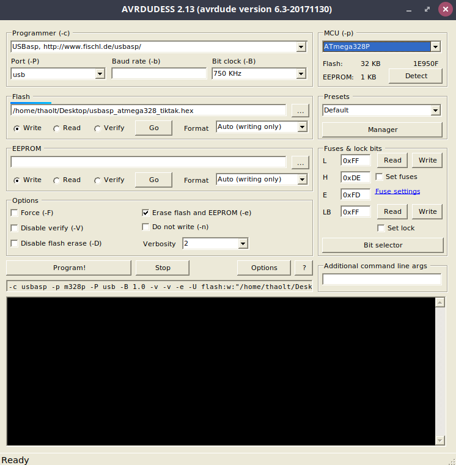
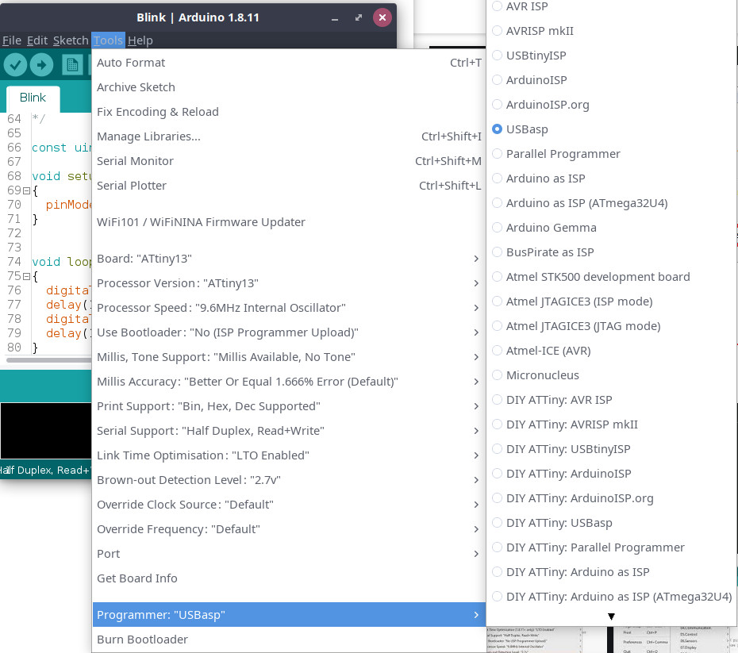
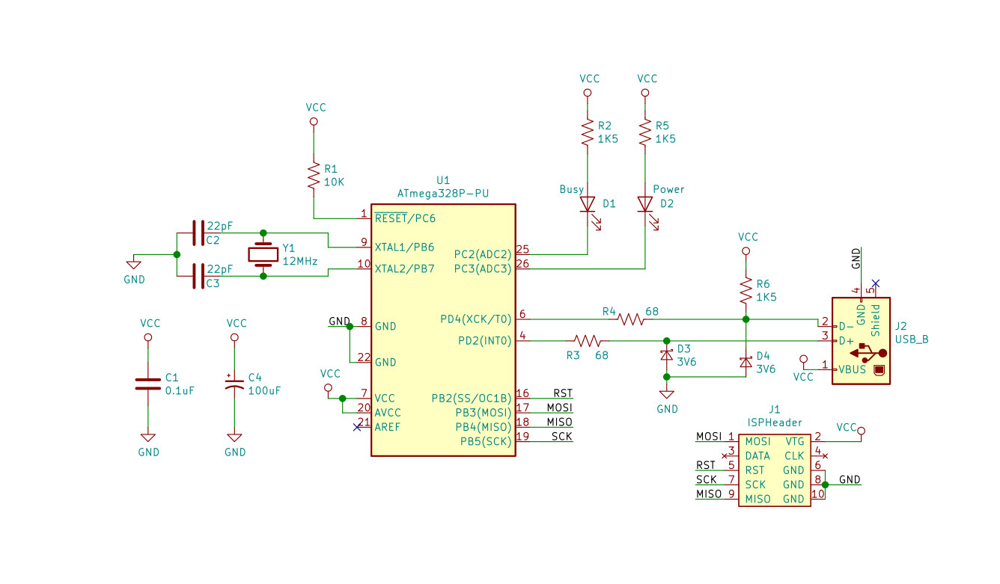
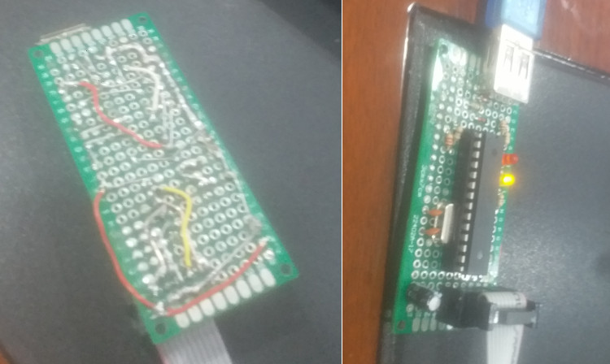

# sardisp

## Content

  * [What is it?](#what-is-it-)
  * [Installation](#installation)
    + [Windows](#windows)
    + [Linux](#linux)
  * [How to use](#how-to-use)
    + [avrdude](#avrdude)
    + [AVRDUDESS](#avrdudess)
    + [Arduino IDE](#arduino-ide)
  * [Tools](#tools)
  * [Schematic](#schematic)
  * [Perf-board implement](#perf-board-implement)
  * [References](#references)


## What is it?

DIY Simple Arduino In-System-Programmer (aka perf-board USBasp clone)

## Installation

### Windows

**Driver installation**

Please read:

* https://zadig.akeo.ie/
* https://electronics.stackexchange.com/questions/416714/avrdude-does-not-recognize-usbasp-device/417509#417509

Or download:

https://raw.githubusercontent.com/thaolt/sardisp/master/drivers/usbasp_signed.zip

### Linux

Linux doesn't need driver installation

However, it would be more convenient to allow current user access USB instead of execute commands under `root` or `sudo`

If you ever run these steps before, they don't need to be executed again

`$USER` is your current login name on your machine

```
sudo adduser $USER dialout
sudo adduser $USER tty
sudo adduser $USER plugdev
```

Then log out of current desktop session and log in again, it's done.

## How to use

Any software / IDE support USBasp programmer

### avrdude

```
avrdude -u -c usbasp -P usb ...
```
### AVRDUDESS



### Arduino IDE

`Tools` > `Programmer` > `USBasp`



## Tools

* **Kicad PCB** software is used for making perf-board design easier. https://kicad.org/
* **AVRDUDESS** is a GUI software for avrdude for flashing the firmware, works on Windows, Mac, Linux. https://blog.zakkemble.net/avrdudess-a-gui-for-avrdude/

## Schematic



## Perf-board implement



## References

* https://www.fischl.de/usbasp/
* https://github.com/obdev/v-usb
* https://hackaday.io/project/27401-creative-repairs-and-hacks/log/156127-replacing-an-atmega8-with-a-atmega328p-on-a-usbasp-board
* https://tiktakx.wordpress.com/tag/diy-usbasp-using-atmega-328/
